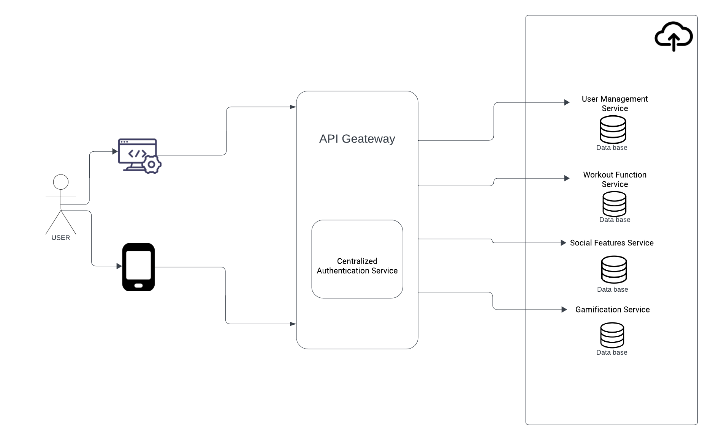

### Концептуальная архитектура приложения

#### Описание микросервисной архитектуры

- **API Gateway**: Входная точка для всех клиентских запросов. Обеспечивает маршрутизацию запросов к соответствующим микросервисам, аутентификацию и агрегацию данных.

- **Микросервисы**:
  - **Сервис управления пользователями**: Управление учетными записями пользователей, хранение профилей и управление доступом.
  - **Сервис тренировочных функций**: Планирование и отслеживание тренировок, анализ результатов и предоставление рекомендаций.
  - **Сервис социальных функций**: Создание и управление сообществами, обмен сообщениями и социальное взаимодействие.
  - **Сервис геймификации**: Игровые элементы для мотивации и вовлечения пользователей, такие как достижения, награды и лидерские таблицы.

- **Облачные сервисы**:
  - Использование облачных ресурсов для гибкого управления инфраструктурой, автоматического масштабирования и балансировки нагрузки.
  - Возможность использования разнообразных облачных сервисов от разных провайдеров в зависимости от специфических потребностей и требований каждого микросервиса.

- **Базы данных**:
  - Каждый микросервис взаимодействует с собственной базой данных, что обеспечивает высокую доступность и консистентность данных в пределах сервиса.
  - Применение политик репликации и резервного копирования для обеспечения безопасности данных и возможности быстрого восстановления после сбоев.

#### Безопасность и авторизация

- **Централизованный сервис аутентификации**: Управление идентификацией пользователей с использованием токенов доступа и обновления, соответствующих стандарту OAuth 2.0.
- **Шифрование**: Все данные, передаваемые между клиентом и сервером, а также между микросервисами, защищены с использованием современных алгоритмов шифрования и протокола TLS/SSL.

#### Клиентская сторона

- **Фронтенд**:
  - Веб-фронтенд, реализованный с использованием современных фреймворков (например, React или Angular), для обеспечения отзывчивого и интерактивного пользовательского интерфейса.
  - Нативные мобильные приложения для iOS и Android, предоставляющие оптимизированный интерфейс и интеграцию с нативными функциями устройств.

