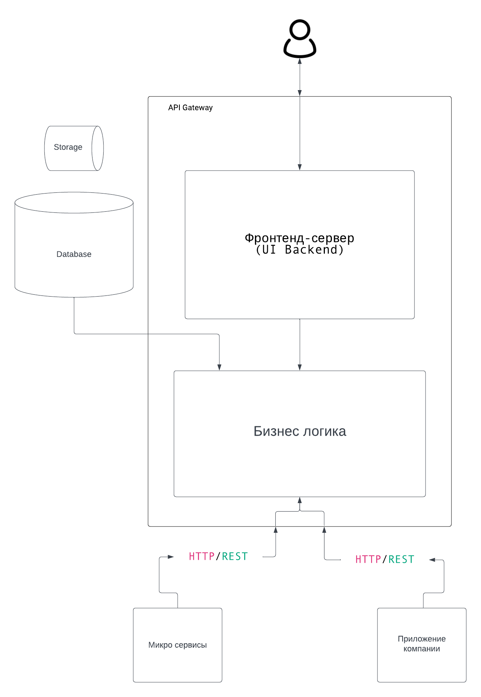
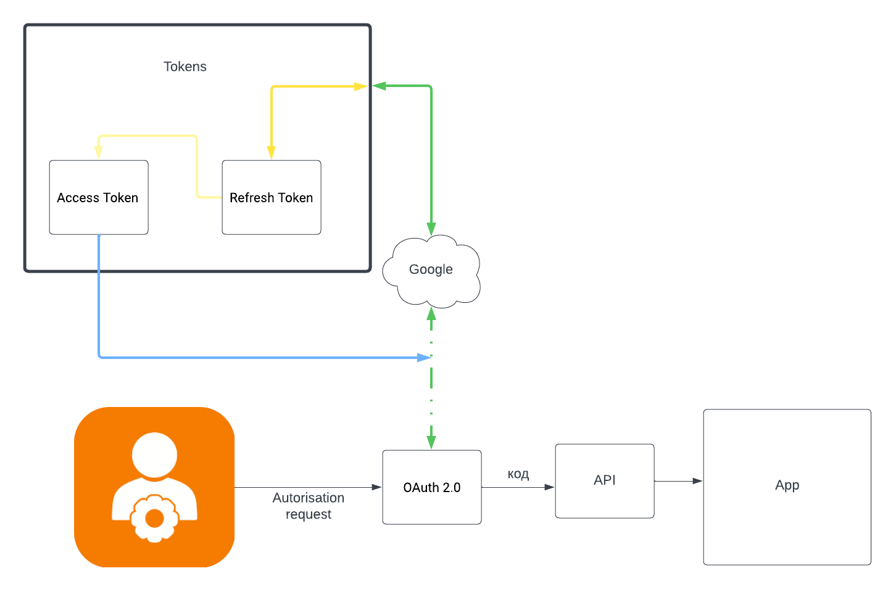

**Функциональное:**

В приложении реализована удобная система регистрации и управления профилем пользователя, позволяя заполнять не только базовую информацию, но и детальный инвентарь и предпочтения. Пользователь может создавать и вступать в социальные группы, находить партнеров для тренировок в своем регионе, а также с легкостью создавать и сохранять персонализированные тренировки. Уведомления о новых сообщениях, достижениях и важных событиях поддерживают активное взаимодействие пользователя с приложением. Интеграция игровых элементов стимулирует активность, а возможность подключения дополнительных устройств, таких как датчики и фитнес-трекеры, расширяет функциональность приложения, делая тренировки более эффективными и увлекательными.

**Информационное:**

Система хранит данные пользователя, включая личную информацию, инвентарь и предпочтения. Данные о тренировках, их параметры и результаты, также надежно сохраняются и используются для анализа. Система сообщений и чата обеспечивает безопасное и конфиденциальное общение между пользователями, сохраняя переписку в защищенной среде. Информация о социальных группах позволяет эффективно управлять группами пользователей. Системные логи фиксируют события, что обеспечивает не только отладку, но и повышение уровня безопасности приложения.

**concurrency**

В архитектуре моего приложения реализована многозадачность с использованием параллельной работы различных сервисов. Сервисы, такие как Сервис Социальных Компонентов, Сервис Тренировочных Функций и Сервис Уведомлений, работают параллельно для обеспечения эффективной обработки запросов. Блок Запросов Пользователей отвечает за прием и обработку запросов, обеспечивая быструю реакцию на действия пользователей. Интеграция Сервиса Чата и Сервиса Уведомлений демонстрирует параллельную обработку сообщений и уведомлений, обеспечивая мгновенное взаимодействие.

В основе архитектуры приложения лежит **микросервисная модель**, где каждый компонент, такой как социальные компоненты, тренировочные функции и уведомления, представлен отдельным **микросервисом**. Эта модель обеспечивает гибкость и независимость каждого компонента, а взаимодействие между ними реализовано асинхронно через технологию **Message Queue**.

В рамках обработки запросов пользователей приложение использует **Concurrency Framework** (например, **asyncio**), что гарантирует эффективное управление многозадачностью и оперативную обработку запросов. Такой подход особенно важен для обеспечения отзывчивости системы при большом количестве одновременных запросов.

Что касается работы с чатом и уведомлениями, здесь использована технология **WebSocket**, позволяющая обеспечить мгновенный обмен сообщениями и уведомлениями в реальном времени. Это создает более динамичный и интерактивный опыт взаимодействия пользователей с приложением, особенно в контексте чата и получения уведомлений о важных событиях.

**Инфраструктурное**

**Безопастность**

**OAuth 2.0**

Когда пользователь хочет войти через внешний сервис (Например VK, Google), он направляется на этот сервис для ввода своих данных. После успешной аутентификации сервис возвращает вашему приложению специальный код. Ваше приложение обменивает этот код на пару токенов: access token и refresh token.

Access token - это ключ, который приложение использует для доступа к данным на сторонних сервисах. Если он устареет, есть refresh token, который позволяет обновить access token без повторной аутентификации пользователя. Таким образом, приложение может взаимодействовать с API сторонних сервисов от его имени.

В итоге, OAuth 2.0 обеспечивает безопасный и удобный механизм для приложения взаимодействовать с данными на сторонних платформах.

