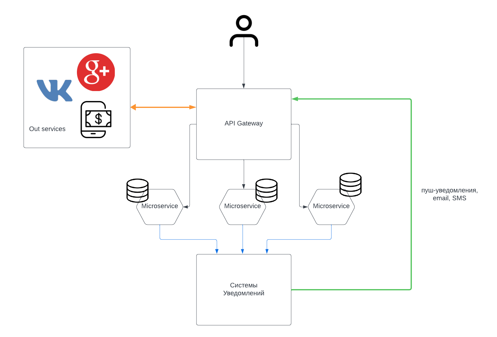
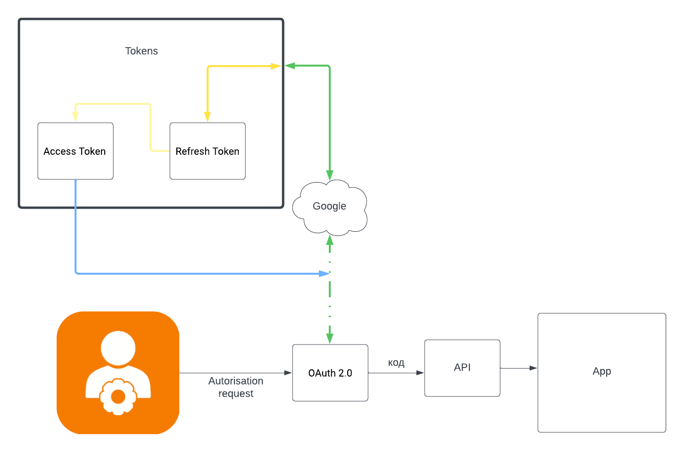

**Функциональное представление:**

В приложении реализована интуитивно понятная система регистрации и управления профилем пользователя. Это включает в себя не только базовую информацию, но и детализированный инвентарь для персонализации тренировочного процесса. Пользователи могут создавать социальные группы, находить тренировочных партнеров и присоединяться к сообществам. Функция создания персонализированных тренировок позволяет пользователям эффективно планировать свои занятия, а система уведомлений обеспечивает постоянную вовлеченность, информируя о новых сообщениях и достижениях. Интегрированные игровые элементы и возможность подключения фитнес-трекеров значительно увеличивают мотивацию и эффективность тренировок.

**Информационное представление:**

Система хранит и обрабатывает разнообразные данные: от личной информации пользователей до данных о тренировках и их результатах. Все сообщения и коммуникация между пользователями защищены и конфиденциальны, а информация о социальных группах позволяет эффективно управлять взаимодействиями внутри сообщества. Системные логи не только способствуют устранению неполадок, но и увеличивают общую безопасность приложения.

**Многозадачность (Concurrency):**

Приложение использует модель многозадачности для параллельной обработки запросов и задач. Это достигается за счет асинхронного взаимодействия между микросервисами, которые обрабатывают различные функции приложения, такие как управление пользователями, тренировки и уведомления. Фреймворки многозадачности, такие как asyncio в Python, используются для эффективного управления параллельными операциями.

**Инфраструктурное представление:**

Инфраструктурное представление демонстрирует использование облачных платформ и сервисов для гибкого управления ресурсами и обеспечения масштабируемости системы. Балансировщики нагрузки распределяют трафик между инстансами микросервисов, а системы мониторинга и логирования обеспечивают наблюдение за работой приложения и быстрое реагирование на инциденты.

**Безопасность:**

Система безопасности строится на использовании протокола OAuth 2.0 для аутентификации и авторизации пользователей. Это обеспечивает безопасный доступ к данным и API, защищая от несанкционированного использования и обеспечивая конфиденциальность личных данных.